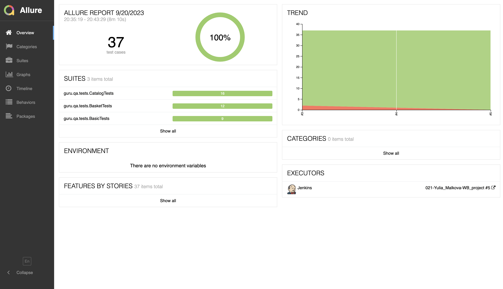
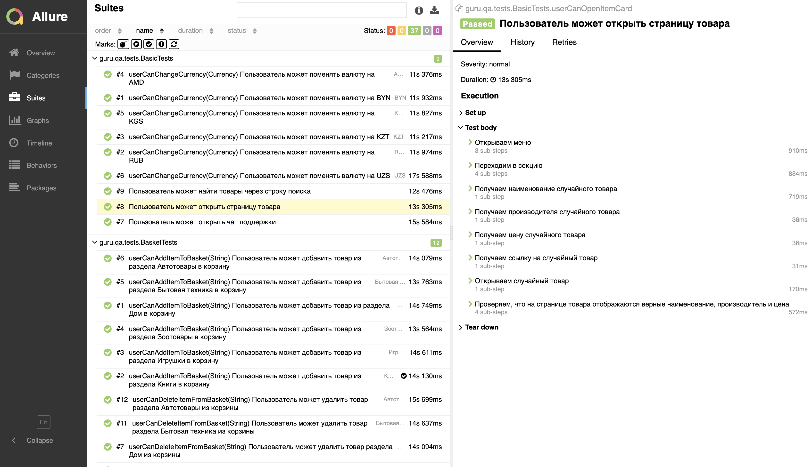
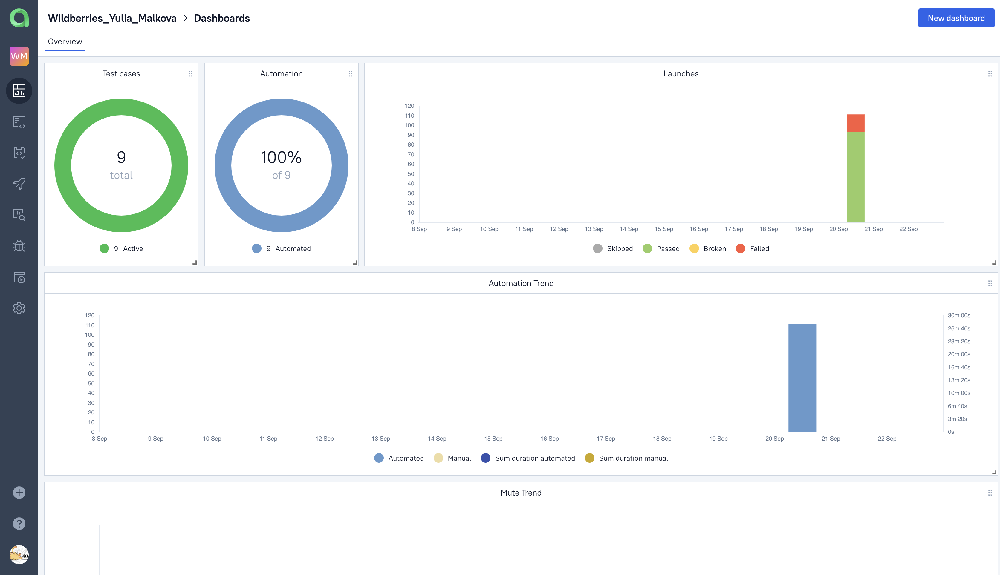
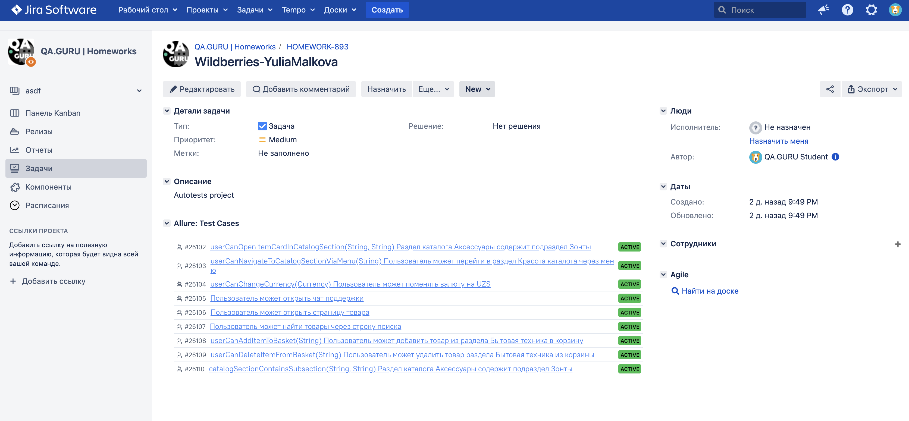
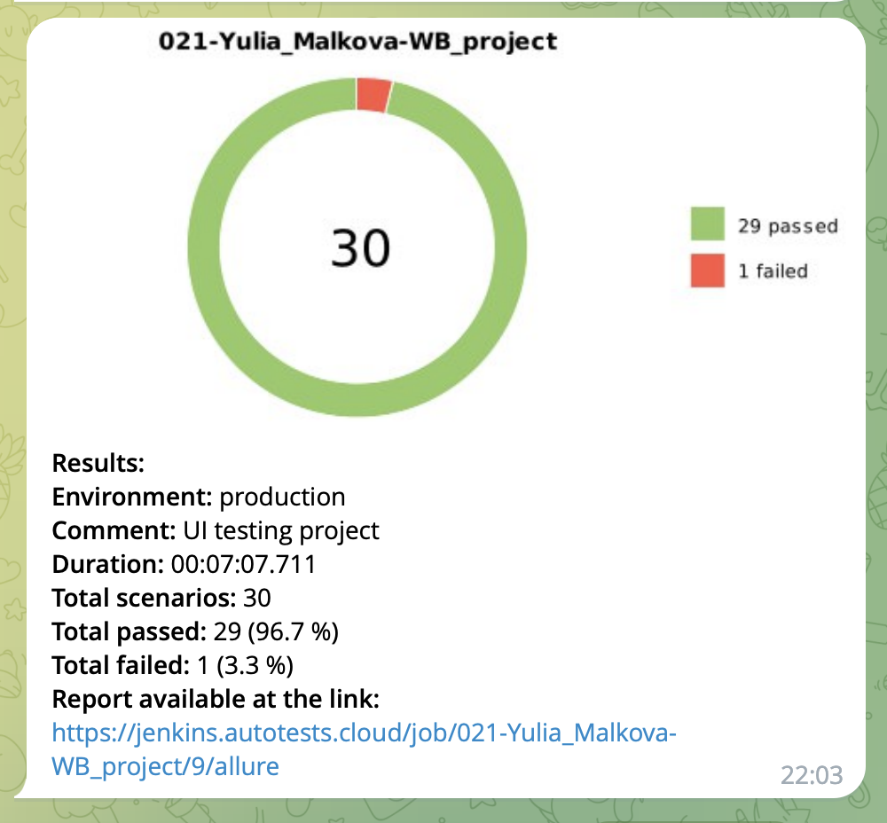
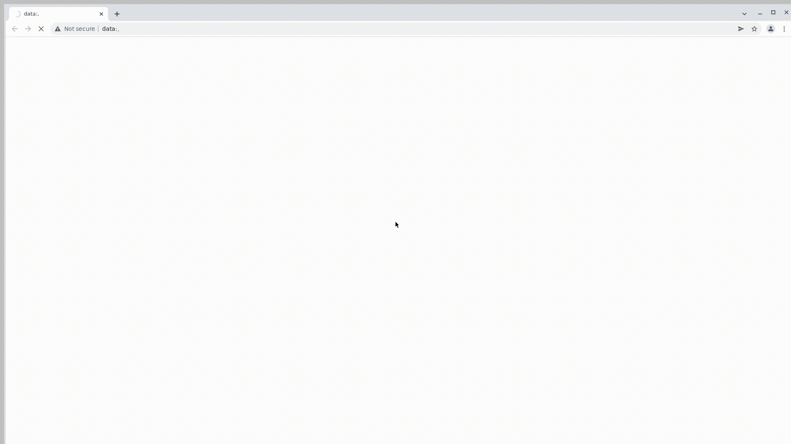

<p align="center">
<a href="https://www.wildberries.ru/">  </a></h1>
<p align="center">

# <p align="center"> Проект по автоматизации тестовых сценариев для  Wildberries <p align="center">

##  Использованный стек технологий
<p align="center">
<a href="https://www.jetbrains.com/idea/">
<a href="https://www.java.com/">
<a href="https://selenide.org/">
<a href="https://aerokube.com/selenoid/latest/">
<a href="https://github.com/allure-framework">
<a href="https://qameta.io/">
<a href="https://gradle.org/">
<a href="https://junit.org/junit5/">
<a href="https://github.com/">
<a href="https://www.jenkins.io/">
<a href="https://web.telegram.org/">
<a href="https://www.atlassian.com/software/jira/">
</p>

- В данном проекте автотесты написаны на языке <code>Java</code> с использованием фреймворка для тестирования Selenide.
- В качестве сборщика был использован - <code>Gradle</code>.
- Использованы фреймворки <code>JUnit 5</code> и [Selenide](https://selenide.org/).
- При прогоне тестов браузер запускается в [Selenoid](https://aerokube.com/selenoid/).
- Для удаленного запуска реализована джоба в Jenkins с формированием Allure-отчета и отправкой результатов в <code>Telegram</code> при помощи бота.
- Осуществлена интеграция с <code>Allure TestOps </code> и <code>Jira</code>.

Содержание Allure-отчета:
* Шаги теста;
* Скриншот страницы на последнем шаге;
* Page Source;
* Логи браузерной консоли;
* Видео выполнения автотеста.

##  Запуск автотестов

### Запуск тестов из терминала

Команда для запуска всех тестов из терминала:
```
gradle clean test
```
При выполнении команды тесты запустятся удаленно в <code>Selenoid</code>.

Для запуска можно выбрать один из трех тест-сьютов:


При необходимости также можно переопределить параметры запуска

```
gradle clean
${TEST_JOB}
-Dbrowser=${BROWSER}
-Dversion=${BROWSER_VERSION}
 -DbrowserSize=${BROWSER_SIZE}
 -DwebDriver=${WEB_DRIVER}
```
### Параметры сборки

* <code>TEST_JOB</code> – тестовый сьют.
* <code>BROWSER_NAME</code> – браузер, в котором будут выполняться тесты. По умолчанию - <code>chrome</code>.
* <code>BROWSER_VERSION</code> – версия браузера, в которой будут выполняться тесты. По умолчанию - <code>100.0</code>.
* <code>BROWSER_SIZE</code> – размер окна браузера, в котором будут выполняться тесты. По умолчанию - <code>1920x1080</code>.
* <code>WEB_DRIVER</code> – адрес удаленного сервера, на котором будут запускаться тесты.

##  Сборка в [Jenkins](https://jenkins.autotests.cloud/job/021-Yulia_Malkova-WB_project/)
<p align="center">

</p>

##  Пример [Allure-отчета](https://jenkins.autotests.cloud/job/021-Yulia_Malkova-WB_project/allure/)
### Overview

<p align="center">

</p>

### Результат выполнения теста

<p align="center">

</p>

##  Интеграция с [Allure TestOps](https://allure.autotests.cloud/project/3682/dashboards)

Выполнена интеграция сборки <code>Jenkins</code> с <code>Allure TestOps</code>.
Результат выполнения автотестов отображается в <code>Allure TestOps</code>
На Dashboard в <code>Allure TestOps</code> отображена статистика пройденных тестов.

<p align="center">

</p>

##  Интеграция с [Jira](https://jira.autotests.cloud/browse/HOMEWORK-893)

Реализована интеграция <code>Allure TestOps</code> с <code>Jira</code>, в тикете отображается информация, какие тест-кейсы были написаны в рамках задачи и результат их прогона.

<p align="center">

</p>

##  Уведомления в Telegram с использованием бота

После завершения сборки, бот созданный в <code>Telegram</code>, автоматически обрабатывает и отправляет сообщение с результатом.

<p align="center">

</p>

##  Видео примера запуска тестов в Selenoid

К каждому тесту в отчете прилагается видео прогона.
<p align="center">
  
</p>
